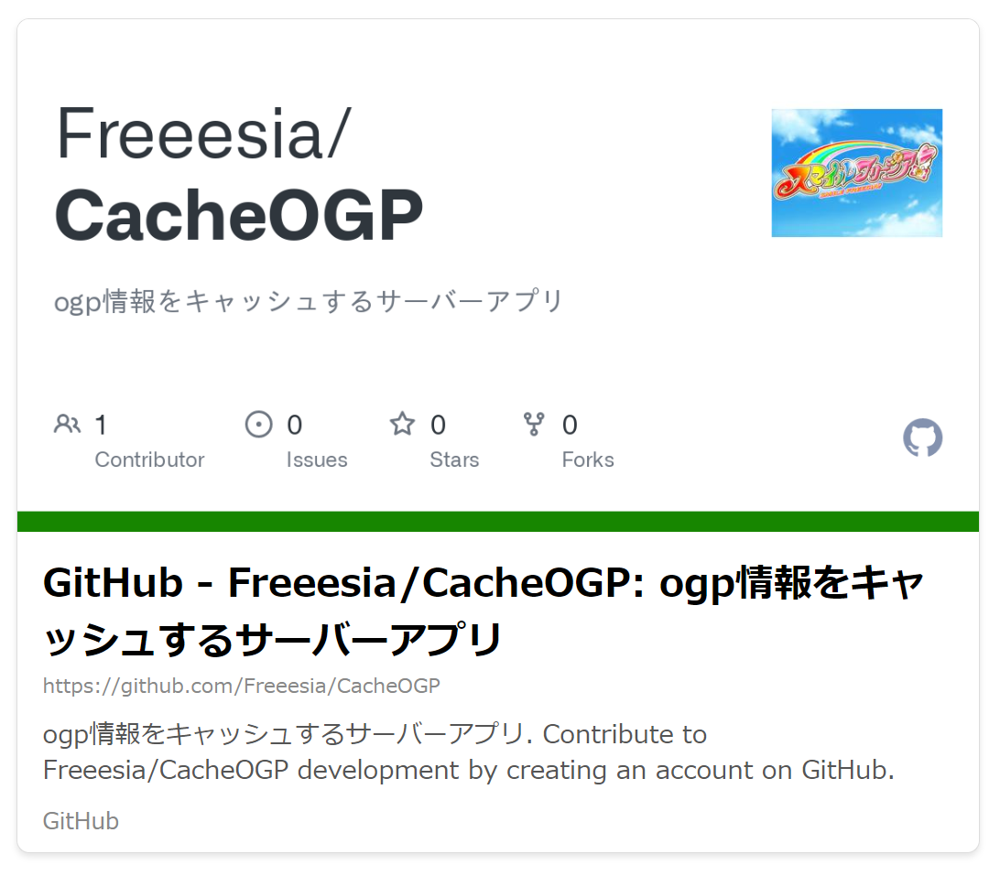
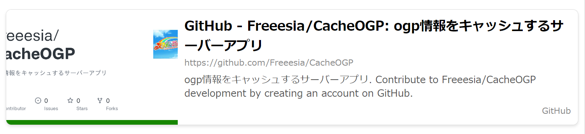
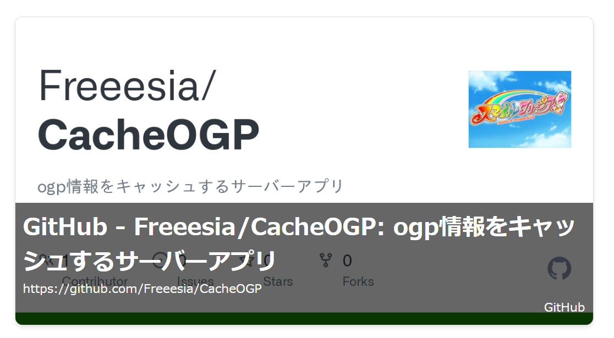

## CacheOGP: Open Graph Protocol 情報取得 Webアプリ

### 概要

CacheOGP は、Webサイトの Open Graph Protocol (OGP) 情報を取得し、表示する Web アプリケーションです。OGP は、Webページが持つ概要情報をまとめたもので、ソーシャルメディアなどで共有されたときに、タイトルや画像、説明文などを適切に表示させるために利用されます。

このアプリケーションでは、ユーザーが入力した URL の OGP 情報を取得し、以下の機能を提供します。

* **OGP 情報の取得:** URL を元に、Webページの OGP 情報 (タイトル、画像 URL、説明文など) を取得します。
    ```json
    {
        "url": "https://github.com/Freeesia/CacheOGP",
        "title": "GitHub - Freeesia/CacheOGP: ogp情報をキャッシュするサーバーアプリ",
        "type": "object",
        "image": "thumb/6cdcf72c-7624-5f27-88f3-08d4ffa35532",
        "siteName": "GitHub",
        "description": "ogp情報をキャッシュするサーバーアプリ. Contribute to Freeesia/CacheOGP development by creating an account on GitHub.",
        "locale": null
    }
    ```
* **OGP 情報の表示:** 取得した OGP 情報を元に、HTML を生成して 埋め込み用のWeb ページとして表示します。
    * 表示スタイルは、ポートレート、ランドスケープ、オーバーレイ、カスタムの 4 種類から選択できます。
    * Portrate
    
    * Landscape
    
    * Overlay
    
* **OGP 画像の取得:** 指定された URL を元に、埋め込み用Webページを描画した結果を画像として取得します。
    * 取得した画像をMarkdownのイメージとして利用することができます。

### 利用方法

#### Docker による起動

```bash
docker run -e ConnectionStrings__cache=redis:6379 \
    -e ConnectionStrings__ogp=Host=postgres;Port=5432;Username=postgres;Password=pass;Database=ogp \
    -p 8000:8000 \
    ghcr.io/freeesia/cache-ogp
```

* **ConnectionStrings__cache**: Redis サーバーの接続文字列です。
* **ConnectionStrings__ogp**: PostgreSQL データベースの接続文字列です。

上記の `docker run` コマンドを実行すると、コンテナが起動し、アプリケーションがアクセスできるようになります。

#### ブラウザでのアクセス

ブラウザで `http://localhost:8000` (または、コンテナがバインドしているポート) にアクセスすると、アプリケーションのトップページが表示されます。

#### 機能

* **トップページ:** URL 入力欄と表示形式選択欄があり、入力した URL の OGP 情報に基づいた HTML が表示されます。
* **OGP 情報の JSON 表示:** 取得した OGP 情報を JSON 形式で表示する機能があります。
* **OGP 画像の表示:** 取得した OGP 画像を様々なスタイルで表示する機能があります。
* **キャッシュ:** OGP 情報は Redis にキャッシュされ、一定時間以内に同じ URL のリクエストがあった場合は、キャッシュされたデータが使用されます。
* **画像処理:** 取得した OGP 画像は、PuppeteerSharp を利用してブラウザ上でレンダリングし、必要なサイズにリサイズしたり、WebP 形式に変換します。

### 貢献

このプロジェクトへの貢献は大歓迎です。
[コントリビュートガイドライン](CODE_OF_CONDUCT.md) を参照してください。
